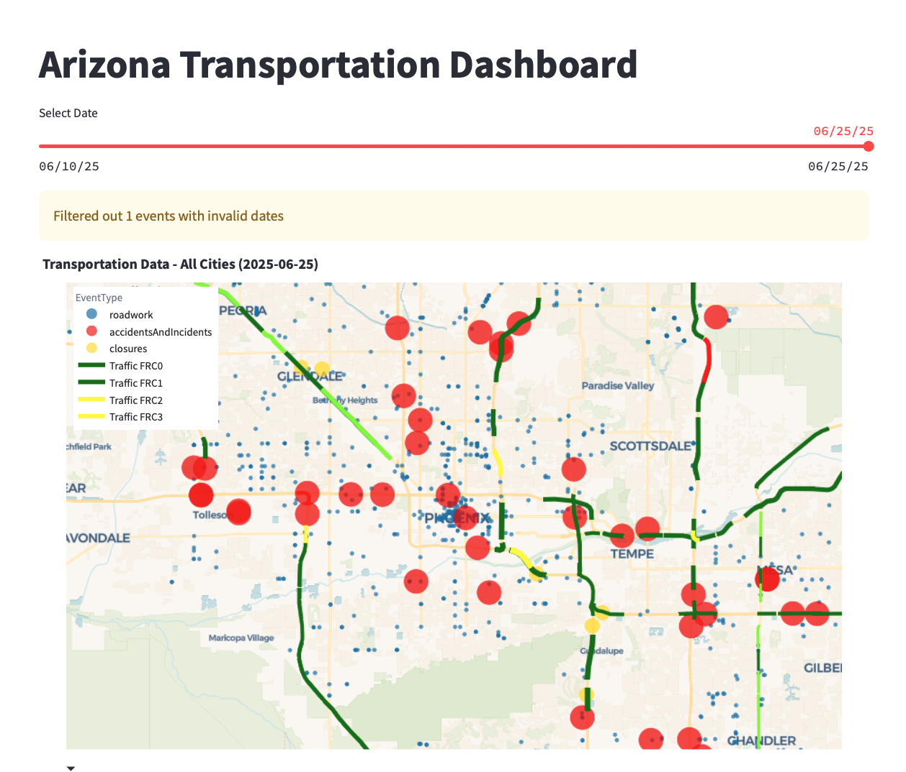

# Arizona Transportation Dashboard

A comprehensive transportation analytics dashboard that visualizes Arizona work zone data and real-time traffic flow using AZ511 and TomTom Traffic API integration.


*Interactive map showing AZ511 work zones and traffic data across Arizona*

## Features

- **AZ511 Work Zone Monitoring**
  - Real-time work zone events
  - Construction and incident tracking
  - Geographic distribution analysis
  - Duration and timing analytics

- **TomTom Traffic Flow Integration**
  - Live traffic speed data from Arizona road networks
  - Polyline-based sampling from az_interstates.geojson and az_sr.geojson
  - Normalized database schema with road segments and traffic data
  - 5-tier color-coded traffic flow visualization
  - Road class filtering (FRC0-FRC6: Motorways to Local roads)
  - Speed ratio calculations (current vs free-flow)


*5-tier color-coded traffic flow visualization with road type filtering*

- **Interactive Visualizations**
  - Combined map view with work zones and traffic flow
  - City-based filtering (Phoenix, Tucson, Flagstaff, Gilbert, Yuma)
  - Date range selection
  - Event type distribution charts
  - Duration analysis histograms

## Prerequisites

- Python 3.10+
- Streamlit
- TomTom API credentials
- SQLite (for data storage)
- Plotly for visualizations

## Installation

1. Clone the repository:
```bash
git clone <repository-url>
cd wzdx
```

2. Install required dependencies:
```bash
pip install streamlit plotly pandas sqlite3 requests python-dotenv numpy shapely osmnx matplotlib
```

3. Set up your TomTom API credentials:
```bash
cp .env.template .env
# Edit .env and add your TOMTOM_API_KEY
```

## Usage

### Data Collection

1. **Collect TomTom Traffic Flow Data**:
```bash
python database/tomtom.py
```
This script:
- Samples points along Arizona interstate and state route polylines from GeoJSON files
- Fetches traffic flow data from TomTom API at strategic road locations
- Uses normalized database schema with road_segments and traffic_data tables
- Implements batch processing (every 50 API calls) for efficiency
- Stores data in `database/tomtom.db` SQLite database with foreign key relationships
- Provides optimization parameters (DEGREE_STEP, API_ZOOM, API_THICKNESS, BATCH_SIZE)

2. **Collect AZ511 Work Zone Data**:
```bash
python database/az511.py
```
This script:
- Fetches work zone events from AZ511 API
- Stores data in `database/az511.db` SQLite database
- Includes construction, incidents, and road closures

3. **Generate Phoenix Freeway Visualization (Optional)**:
```bash
python database/freeways.py
```
This utility script:
- Extracts Phoenix freeway networks using OSMnx
- Samples freeway points and saves to `freeway_points.json`
- Creates visualization map saved as `images/freeways_map.png`
- Uses minimal dependencies (osmnx, matplotlib) with robust error handling

### Testing and Sample Point Generation

**Generate TomTom Sample Points (Without API Calls)**:
```bash
# Run without TOMTOM_API_KEY to generate sample points only
python database/tomtom.py
```
When run without API credentials, the script will:
- Load polylines from GeoJSON files
- Generate sample points along Arizona road networks
- Save sample points to `tomtom_sample_points.json`
- Display statistics about road coverage and sampling
- Show example API request format for testing

This is useful for:
- Validating polyline sampling before making API calls
- Understanding coverage areas and point density
- Testing road network data integrity
- Planning API usage and costs

### Dashboard

**Start the Transportation Dashboard**:
```bash
streamlit run dashboard/az511app.py
```

Dashboard Features:
- **Data Source Selection**: Toggle between AZ511 work zones and TomTom traffic flow
- **Geographic Filtering**: Filter by city (Phoenix, Tucson, Flagstaff, Gilbert, Yuma)
- **Date Selection**: View data for specific dates
- **Interactive Map**: 
  - AZ511 events shown as colored markers (by event type)
  - TomTom traffic flow displayed as colored polylines with 5-tier speed system:
    - Green: Excellent flow (90%+ free flow speed)
    - Light Green: Good flow (70-90%)
    - Yellow: Moderate flow (50-70%)
    - Orange: Slow flow (30-50%)
    - Red: Very slow/stopped (<30%)
  - Arizona road network overlay from GeoJSON files (interstates and state routes)
  - Functional Road Class (FRC) filtering with performance optimizations
  - Smart rendering limits for local roads (FRC4+ limited to 1000 segments)
  - Legend positioned on the right side of the map
- **Analytics Charts**: 
  - Event type distribution
  - Work zone duration analysis
  - Update vs start date patterns


*Comprehensive analytics including event distributions, duration analysis, and temporal patterns*

## Project Structure

```
wzdx/
├── database/                     # Database files and data collection scripts
│   ├── az511.db                 # SQLite database for AZ511 work zones
│   ├── az511.py                 # AZ511 data collection script
│   ├── tomtom.db                # SQLite database for TomTom traffic flow (normalized schema)
│   ├── tomtom.py                # TomTom traffic flow collection script (polyline-based)
│   ├── az_interstates.geojson   # Arizona interstate highway polylines
│   ├── az_sr.geojson            # Arizona state route polylines
│   ├── freeways.py              # Phoenix freeway extraction and visualization
│   ├── freeway_points.json      # Sampled freeway points (output)
│   ├── tomtom_sample_points.json # TomTom API sample points (output)
│   ├── workzones.db             # General work zone database
│   └── wzdx.py                  # Work zone data processing script
├── dashboard/                    # Streamlit dashboard applications
│   ├── az511app.py              # Main transportation dashboard
│   └── wzdxapp.py               # Work zone specific dashboard
├── images/                       # Dashboard screenshots and documentation images
│   ├── workzone.png             # Work zone dashboard screenshot
│   ├── tomtom.png               # TomTom traffic flow screenshot
│   ├── analytics.png            # Analytics dashboard screenshot
│   └── freeways_map.png         # Phoenix freeway visualization (output)
├── inrix/                       # Legacy structure (may contain additional utilities)
├── .env                         # Environment variables (API keys)
├── .env.template                # Template for environment variables
├── .gitignore                   # Git ignore file (excludes .db files and .env)
├── README.md                    # This file
├── requirements.txt             # Python dependencies
└── setup.py                    # Package setup configuration
```

## Database Schemas

### AZ511 Database (`database/az511.db`)
```sql
TABLE events (
    ID, Organization, RoadwayName, DirectionOfTravel,
    Description, Reported, LastUpdated, StartDate,
    PlannedEndDate, LanesAffected, Latitude, Longitude,
    EventType, IsFullClosure, Severity
)
```

### TomTom Database (`database/tomtom.db`)
**Normalized Schema with Foreign Key Relationships:**

```sql
-- Stable road segment information
TABLE road_segments (
    segment_id TEXT PRIMARY KEY,     -- Unique segment identifier (SHA256 hash)
    openlr TEXT,                     -- OpenLR location reference
    frc TEXT,                        -- Functional Road Class (FRC0-FRC6)
    coordinates TEXT,                -- JSON array of lat/lon points for polyline
    coordinate_lat REAL,             -- Primary coordinate latitude
    coordinate_lon REAL,             -- Primary coordinate longitude
    created_timestamp INTEGER       -- Segment creation timestamp
)

-- Time-varying traffic data
TABLE traffic_data (
    id INTEGER PRIMARY KEY AUTOINCREMENT,
    segment_id TEXT,                 -- Foreign key to road_segments
    hash_id TEXT UNIQUE,             -- Unique identifier for this traffic measurement
    timestamp INTEGER,               -- Data collection timestamp
    currentSpeed REAL,               -- Current speed (mph)
    freeFlowSpeed REAL,              -- Free flow speed (mph)
    currentTravelTime INTEGER,       -- Current travel time (seconds)
    freeFlowTravelTime INTEGER,      -- Free flow travel time (seconds)
    confidence REAL,                 -- Data confidence level (0-1)
    roadClosure BOOLEAN,             -- Road closure status
    version TEXT,                    -- TomTom API version
    FOREIGN KEY (segment_id) REFERENCES road_segments(segment_id)
)
```

## Data Flow

### TomTom Traffic Flow Data (Polyline-Based Collection)
1. **Polyline Source**: Loads Arizona road networks from `az_interstates.geojson` and `az_sr.geojson`
2. **Point Sampling**: Samples points along polylines at configurable intervals (default: 0.025 degrees ≈ 2.75km)
3. **API Collection**: `database/tomtom.py` queries TomTom API for each sampled point
4. **Normalized Storage**: 
   - **road_segments**: Stores stable segment information (coordinates, FRC, location)
   - **traffic_data**: Stores time-varying traffic measurements with foreign key relationships
5. **Batch Processing**: Inserts data every 50 API calls for efficiency with rate limiting (200ms delays)
6. **Visualization**: Dashboard renders traffic flow as colored polylines with optimized performance
   - Segments grouped by FRC and color for efficient rendering
   - Coordinate simplification for long segments (sample every 3rd point)
   - Smart limiting for local roads (FRC4+ limited to 1000 segments)

### Arizona Road Network Data
1. **GeoJSON Sources**: 
   - `az_interstates.geojson`: Major interstate highways (I-10, I-17, I-40, etc.)
   - `az_sr.geojson`: Arizona state routes (SR-51, SR-101, SR-202, etc.)
2. **Data Source**: Created using geojson.io for accurate road network representation
3. **Visualization**: Displayed as separate map layers with distinct colors and opacity
4. **Integration**: Used both for TomTom sampling points and as visual road network overlay

### AZ511 Work Zone Data
1. **Collection**: `database/az511.py` fetches work zone events from AZ511 API
2. **Processing**: Handles datetime conversions and data validation
3. **Storage**: Stores events in `database/az511.db` with full temporal information
4. **Visualization**: Dashboard shows events as markers with analytics charts

## API Configuration

### TomTom Traffic API (Polyline-Based Sampling)
- **Coverage**: Arizona statewide road networks (interstates and state routes)
- **Sampling Method**: Points sampled along actual road polylines at ~2.75km intervals
- **Data Sources**: 
  - `az_interstates.geojson`: Major interstate highways
  - `az_sr.geojson`: Arizona state routes
- **API Parameters**:
  - `DEGREE_STEP`: 0.025 (sampling interval in degrees)
  - `API_ZOOM`: 10 (TomTom zoom level for coverage vs detail)
  - `API_THICKNESS`: 10 (captures parallel roads)
  - `BATCH_SIZE`: 50 (database insert frequency)
- **Rate Limiting**: 200ms delay between API calls to respect TomTom limits
- **Optimization**: Configurable parameters for balancing API efficiency vs coverage
- **Deduplication**: Prevents duplicate traffic data using segment_id + timestamp hashing

### Database Schema Benefits
- **Normalized Design**: Separates stable road information from time-varying traffic data
- **Foreign Key Relationships**: Maintains data integrity between road_segments and traffic_data
- **Query Efficiency**: Indexed tables for fast filtering by FRC, location, and timestamp
- **Storage Optimization**: Avoids duplicating road segment information for each traffic measurement

### AZ511 API
- **Coverage**: Statewide Arizona work zones and incidents
- **Event Types**: Construction, accidents, closures, special events
- **Update Frequency**: Real-time as events are reported
- **Data Retention**: Historical events with start/end dates

## Resources
- AZ state routes: https://en.wikipedia.org/wiki/List_of_state_routes_in_Arizona#/map/0
- geojson.io: https://geojson.io/#new&map=10.75/33.4155/-111.7815
- TomTom developer: https://developer.tomtom.com/user/me/analytics
## Contributing

1. Fork the repository
2. Create a feature branch
3. Submit a pull request

## License

MIT License